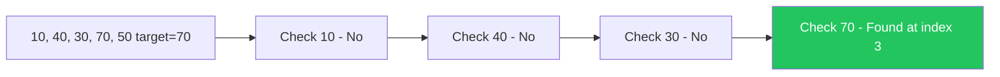
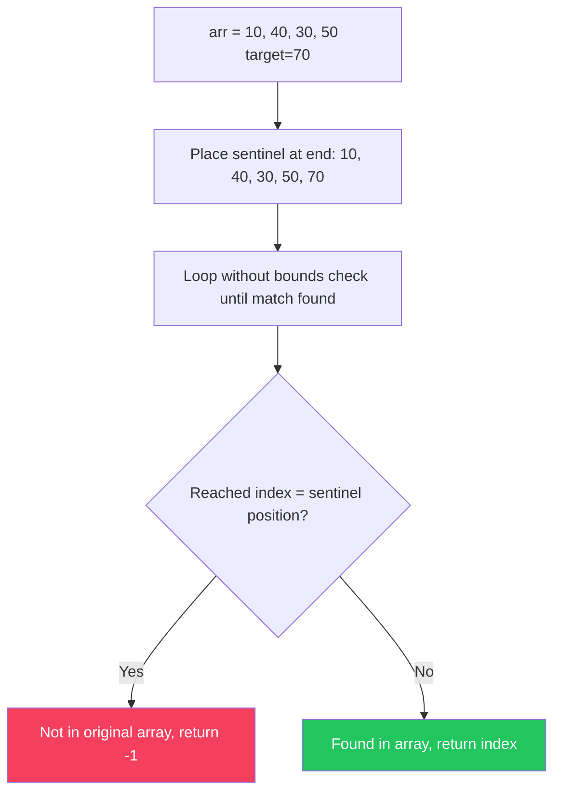
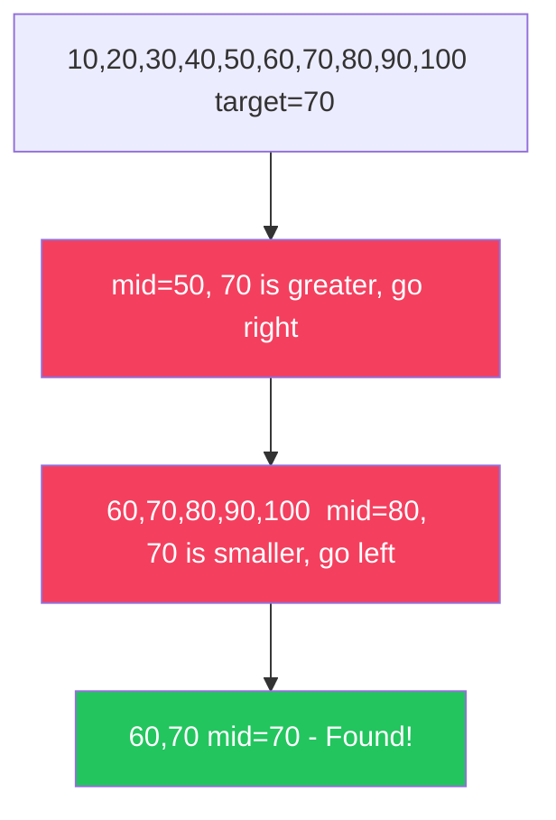
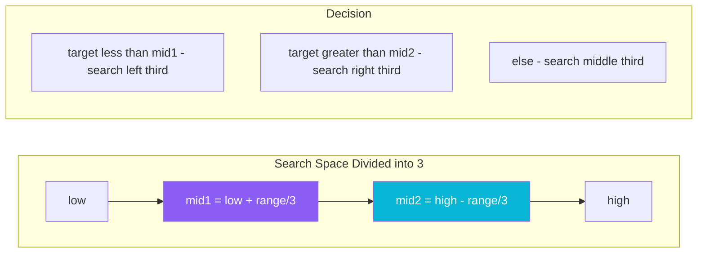
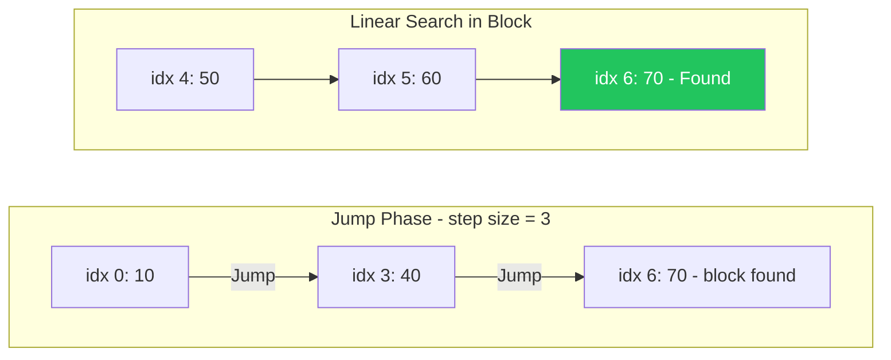
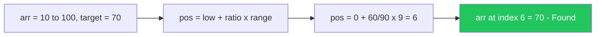
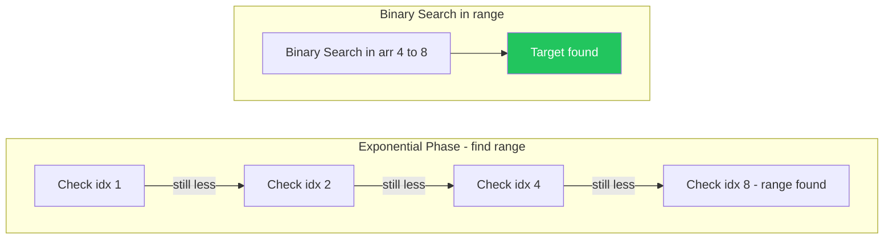
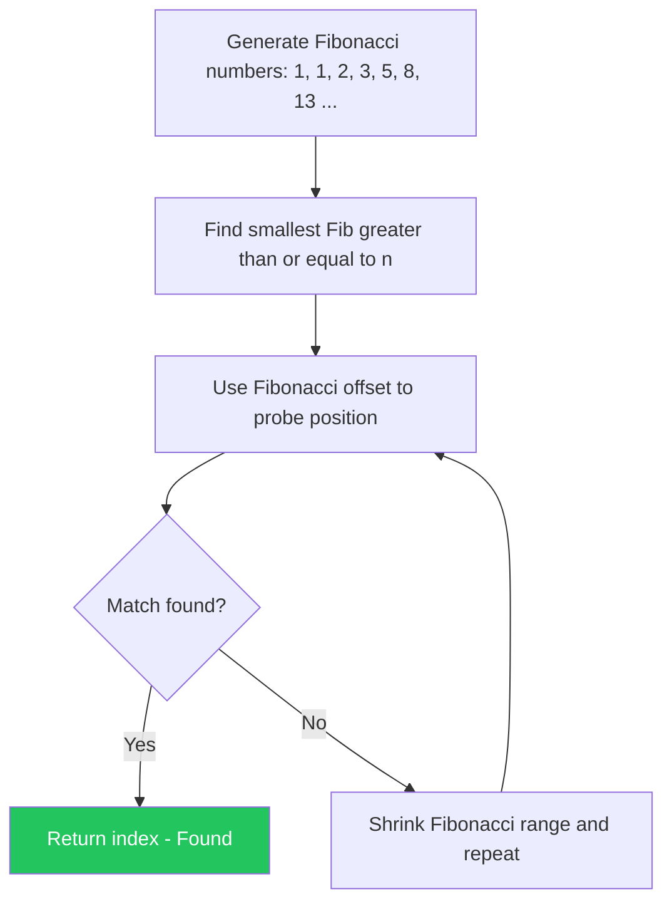
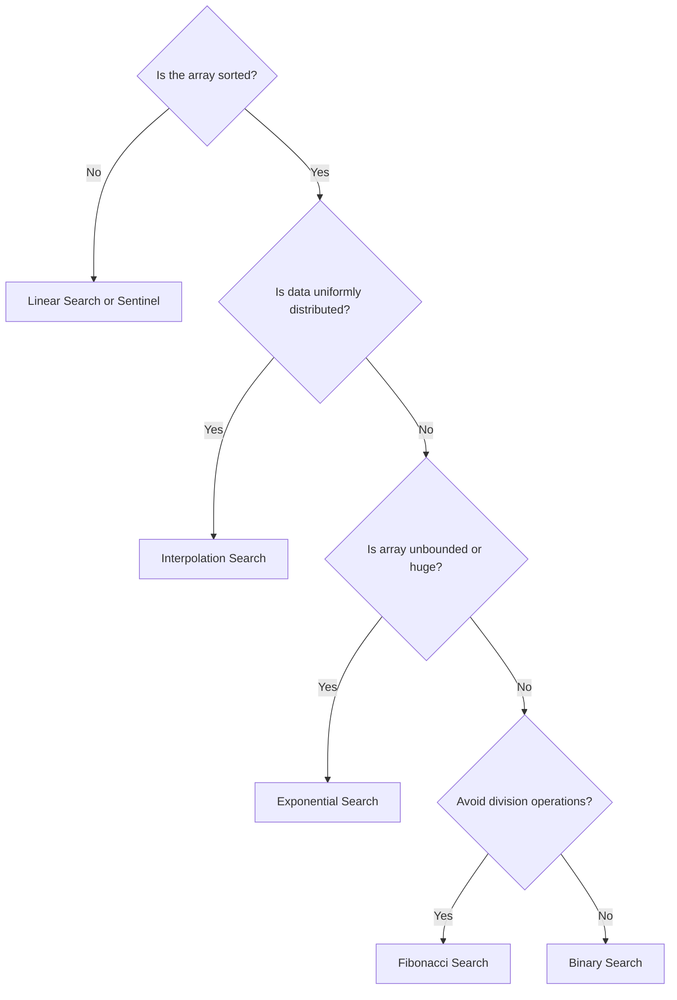

# Searching Algorithms

Searching is the algorithmic process of finding a target value within a collection of elements. The collection can be sorted or unsorted, which determines the best strategy to use.

---

## Searching Algorithms Comparison

| Algorithm | Best Case | Average Case | Worst Case | Space | Sorted Required? |
| :--- | :---: | :---: | :---: | :---: | :---: |
| **Linear Search** | $O(1)$ | $O(N)$ | $O(N)$ | $O(1)$ | ❌ No |
| **Sentinel Linear Search** | $O(1)$ | $O(N)$ | $O(N)$ | $O(1)$ | ❌ No |
| **Binary Search** | $O(1)$ | $O(\log N)$ | $O(\log N)$ | $O(1)$ | ✅ Yes |
| **Ternary Search** | $O(1)$ | $O(\log_3 N)$ | $O(\log_3 N)$ | $O(1)$ | ✅ Yes |
| **Jump Search** | $O(1)$ | $O(\sqrt{N})$ | $O(\sqrt{N})$ | $O(1)$ | ✅ Yes |
| **Interpolation Search** | $O(1)$ | $O(\log \log N)$ | $O(N)$ | $O(1)$ | ✅ Yes (Uniform) |
| **Exponential Search** | $O(1)$ | $O(\log N)$ | $O(\log N)$ | $O(1)$ | ✅ Yes |
| **Fibonacci Search** | $O(1)$ | $O(\log N)$ | $O(\log N)$ | $O(1)$ | ✅ Yes |

---

## 1. Linear Search

Checks every element one by one from left to right until the target is found or the list is exhausted.



```java
public class LinearSearch {
    public static int search(int[] arr, int target) {
        for (int i = 0; i < arr.length; i++) {
            if (arr[i] == target) return i; // Found at index i
        }
        return -1; // Not found
    }
}
```

> **Key Insight**: Works on unsorted arrays. Simple but slow for large datasets. Best when data is small or unordered.

---

## 2. Sentinel Linear Search

Optimized Linear Search that places the target at the end of the array (sentinel) to eliminate the bounds check inside the loop, reducing comparisons per iteration.



```java
public class SentinelLinearSearch {
    public static int search(int[] arr, int target) {
        int n = arr.length;
        int last = arr[n - 1];          // Save last element
        arr[n - 1] = target;            // Place sentinel

        int i = 0;
        while (arr[i] != target) i++;   // No bounds check needed

        arr[n - 1] = last;              // Restore last element

        // Check if we found it before the sentinel
        if (i < n - 1 || arr[n - 1] == target) return i;
        return -1;
    }
}
```

> **Key Insight**: Saves one comparison per iteration vs standard Linear Search. Useful when you process billions of iterations.

---

## 3. Binary Search

Repeatedly halves the search space by comparing the target with the middle element. Requires a **sorted** array.



**Iterative:**
```java
public class BinarySearch {
    public static int iterative(int[] arr, int target) {
        int low = 0, high = arr.length - 1;
        while (low <= high) {
            int mid = low + (high - low) / 2; // Avoids overflow
            if (arr[mid] == target) return mid;
            else if (arr[mid] < target) low = mid + 1;
            else high = mid - 1;
        }
        return -1;
    }

    // Recursive version
    public static int recursive(int[] arr, int target, int low, int high) {
        if (low > high) return -1;
        int mid = low + (high - low) / 2;
        if (arr[mid] == target) return mid;
        if (arr[mid] < target) return recursive(arr, target, mid + 1, high);
        return recursive(arr, target, low, mid - 1);
    }
}
```

> **Key Insight**: `mid = low + (high - low) / 2` prevents integer overflow vs `(low + high) / 2`. Always use this form.

---

## 4. Ternary Search

Divides the search space into **three** parts using two midpoints. Useful for finding the minimum/maximum of a unimodal function.



```java
public class TernarySearch {
    public static int search(int[] arr, int target, int low, int high) {
        if (low > high) return -1;

        int mid1 = low + (high - low) / 3;
        int mid2 = high - (high - low) / 3;

        if (arr[mid1] == target) return mid1;
        if (arr[mid2] == target) return mid2;

        if (target < arr[mid1])
            return search(arr, target, low, mid1 - 1);       // Left third
        else if (target > arr[mid2])
            return search(arr, target, mid2 + 1, high);      // Right third
        else
            return search(arr, target, mid1 + 1, mid2 - 1); // Middle third
    }
}
```

> **Key Insight**: Despite $O(\log_3 N)$ comparisons, it's **not faster** than Binary Search in practice because it makes 4 comparisons per iteration vs 2. Best suited for **unimodal function optimization**.

---

## 5. Jump Search

Jumps ahead by fixed steps of $\sqrt{N}$, then performs a linear search within the identified block.



```java
public class JumpSearch {
    public static int search(int[] arr, int target) {
        int n = arr.length;
        int step = (int) Math.sqrt(n); // Block size
        int prev = 0;

        // Jump ahead until block containing target
        while (arr[Math.min(step, n) - 1] < target) {
            prev = step;
            step += (int) Math.sqrt(n);
            if (prev >= n) return -1;
        }

        // Linear search in the identified block
        while (arr[prev] < target) {
            prev++;
            if (prev == Math.min(step, n)) return -1;
        }

        return (arr[prev] == target) ? prev : -1;
    }
}
```

> **Key Insight**: Optimal block size is $\sqrt{N}$. Better than Linear ($O(N)$) but worse than Binary ($O(\log N)$). Ideal for systems where **backward traversal is expensive** (e.g., magnetic tape).

---

## 6. Interpolation Search

Estimates the probable position of the target based on value distribution — like how you'd look up a word in a dictionary by jumping closer to where it should be alphabetically.



```java
public class InterpolationSearch {
    public static int search(int[] arr, int target) {
        int low = 0, high = arr.length - 1;

        while (low <= high && target >= arr[low] && target <= arr[high]) {
            if (low == high) {
                return (arr[low] == target) ? low : -1;
            }

            // Probe position formula
            int pos = low + ((target - arr[low]) * (high - low))
                           / (arr[high] - arr[low]);

            if (arr[pos] == target) return pos;
            if (arr[pos] < target) low = pos + 1;
            else high = pos - 1;
        }
        return -1;
    }
}
```

> **Key Insight**: Achieves $O(\log \log N)$ for **uniformly distributed** data. Degrades to $O(N)$ for skewed distributions. Best for phone books, dictionaries, large uniform datasets.

---

## 7. Exponential Search

Finds the range where the target exists by doubling the index, then applies Binary Search in that range. Best for **unbounded/infinite arrays**.



```java
public class ExponentialSearch {
    public static int search(int[] arr, int target) {
        int n = arr.length;
        if (arr[0] == target) return 0;

        // Find range by doubling
        int i = 1;
        while (i < n && arr[i] <= target) i *= 2;

        // Binary search in found range
        return binarySearch(arr, target, i / 2, Math.min(i, n - 1));
    }

    private static int binarySearch(int[] arr, int target, int low, int high) {
        while (low <= high) {
            int mid = low + (high - low) / 2;
            if (arr[mid] == target) return mid;
            else if (arr[mid] < target) low = mid + 1;
            else high = mid - 1;
        }
        return -1;
    }
}
```

> **Key Insight**: Time complexity is $O(\log N)$ — same as Binary Search but better when the target is near the **beginning** of a very large or unbounded array.

---

## 8. Fibonacci Search

Uses Fibonacci numbers to divide the array. Unlike Binary Search (divides by 2), it divides into unequal parts based on Fibonacci ratio.



```java
public class FibonacciSearch {
    public static int search(int[] arr, int target) {
        int n = arr.length;
        int fibM2 = 0; // (m-2)th Fibonacci
        int fibM1 = 1; // (m-1)th Fibonacci
        int fibM  = 1; // mth Fibonacci

        // Find smallest Fibonacci >= n
        while (fibM < n) {
            fibM2 = fibM1;
            fibM1 = fibM;
            fibM  = fibM1 + fibM2;
        }

        int offset = -1;
        while (fibM > 1) {
            int i = Math.min(offset + fibM2, n - 1);

            if (arr[i] < target) {
                fibM  = fibM1;
                fibM1 = fibM2;
                fibM2 = fibM - fibM1;
                offset = i;
            } else if (arr[i] > target) {
                fibM  = fibM2;
                fibM1 = fibM1 - fibM2;
                fibM2 = fibM - fibM1;
            } else {
                return i; // Found!
            }
        }

        // Check last element
        if (fibM1 == 1 && arr[offset + 1] == target) return offset + 1;
        return -1;
    }
}
```

> **Key Insight**: Fibonacci Search avoids division operations (uses only addition/subtraction), making it faster on systems where **division is expensive**. Useful in older hardware or embedded systems.

---

## Choosing the Right Search Algorithm



| Scenario | Best Algorithm |
|---|---|
| Unsorted array | Linear Search |
| Small dataset | Linear or Sentinel Search |
| Sorted, general purpose | Binary Search |
| Sorted, uniformly distributed values | Interpolation Search |
| Very large / unbounded sorted array | Exponential Search |
| System without division instruction | Fibonacci Search |
| Magnetic tape / backward-costly traversal | Jump Search |
| Find min/max of unimodal function | Ternary Search |

---

## Advanced: Binary Search Patterns

Binary Search is far more powerful than just finding a value. It solves many real-world problems:

### Find First Occurrence
```java
public static int firstOccurrence(int[] arr, int target) {
    int low = 0, high = arr.length - 1, result = -1;
    while (low <= high) {
        int mid = low + (high - low) / 2;
        if (arr[mid] == target) { result = mid; high = mid - 1; } // Go left
        else if (arr[mid] < target) low = mid + 1;
        else high = mid - 1;
    }
    return result;
}
```

### Find Last Occurrence
```java
public static int lastOccurrence(int[] arr, int target) {
    int low = 0, high = arr.length - 1, result = -1;
    while (low <= high) {
        int mid = low + (high - low) / 2;
        if (arr[mid] == target) { result = mid; low = mid + 1; } // Go right
        else if (arr[mid] < target) low = mid + 1;
        else high = mid - 1;
    }
    return result;
}
```

### Search in Rotated Sorted Array
```java
public static int searchRotated(int[] arr, int target) {
    int low = 0, high = arr.length - 1;
    while (low <= high) {
        int mid = low + (high - low) / 2;
        if (arr[mid] == target) return mid;
        // Left half is sorted
        if (arr[low] <= arr[mid]) {
            if (target >= arr[low] && target < arr[mid]) high = mid - 1;
            else low = mid + 1;
        } else { // Right half is sorted
            if (target > arr[mid] && target <= arr[high]) low = mid + 1;
            else high = mid - 1;
        }
    }
    return -1;
}
```

> **Key Insight**: Binary Search's "eliminate half the space" idea applies to any **monotonic** decision function, not just sorted arrays.
