# Sorting Algorithms

Sorting is the process of arranging elements in a logical, structured sequence (typically ascending or descending order). Sorting algorithms are classified into **comparison-based** and **non-comparison-based** types.

---

## Sorting Complexity & Stability Matrix

| Algorithm | Best Case | Average Case | Worst Case | Space | Stability |
| :--- | :---: | :---: | :---: | :---: | :---: |
| **Bubble Sort** | $O(N)$ | $O(N^2)$ | $O(N^2)$ | $O(1)$ | ✅ Stable |
| **Selection Sort** | $O(N^2)$ | $O(N^2)$ | $O(N^2)$ | $O(1)$ | ❌ Unstable |
| **Insertion Sort** | $O(N)$ | $O(N^2)$ | $O(N^2)$ | $O(1)$ | ✅ Stable |
| **Shell Sort** | $O(N \log N)$ | $O(N^{1.5})$ | $O(N^2)$ | $O(1)$ | ❌ Unstable |
| **Merge Sort** | $O(N \log N)$ | $O(N \log N)$ | $O(N \log N)$ | $O(N)$ | ✅ Stable |
| **Quick Sort** | $O(N \log N)$ | $O(N \log N)$ | $O(N^2)$ | $O(\log N)$ | ❌ Unstable |
| **Heap Sort** | $O(N \log N)$ | $O(N \log N)$ | $O(N \log N)$ | $O(1)$ | ❌ Unstable |
| **Counting Sort** | $O(N + K)$ | $O(N + K)$ | $O(N + K)$ | $O(N + K)$ | ✅ Stable |
| **Radix Sort** | $O(d(N + B))$ | $O(d(N + B))$ | $O(d(N + B))$ | $O(N + B)$ | ✅ Stable |
| **Tim Sort** | $O(N)$ | $O(N \log N)$ | $O(N \log N)$ | $O(N)$ | ✅ Stable |

---

## 1. Bubble Sort

Repeatedly swaps adjacent elements if they are in the wrong order. Each pass bubbles the largest element to the end.

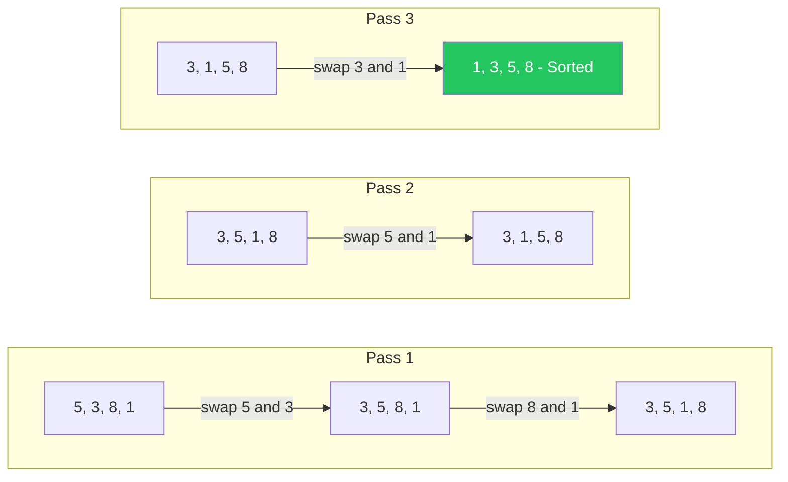

```java
public class BubbleSort {
    public static void sort(int[] arr) {
        int n = arr.length;
        for (int i = 0; i < n - 1; i++) {
            boolean swapped = false;
            for (int j = 0; j < n - i - 1; j++) {
                if (arr[j] > arr[j + 1]) {
                    // Swap
                    int temp = arr[j];
                    arr[j] = arr[j + 1];
                    arr[j + 1] = temp;
                    swapped = true;
                }
            }
            // Early termination if no swap in a pass
            if (!swapped) break;
        }
    }
}
```

> **Key Insight**: The `swapped` flag makes it $O(N)$ on already-sorted arrays.

---

## 2. Selection Sort

Finds the minimum element from the unsorted portion and places it at the beginning.

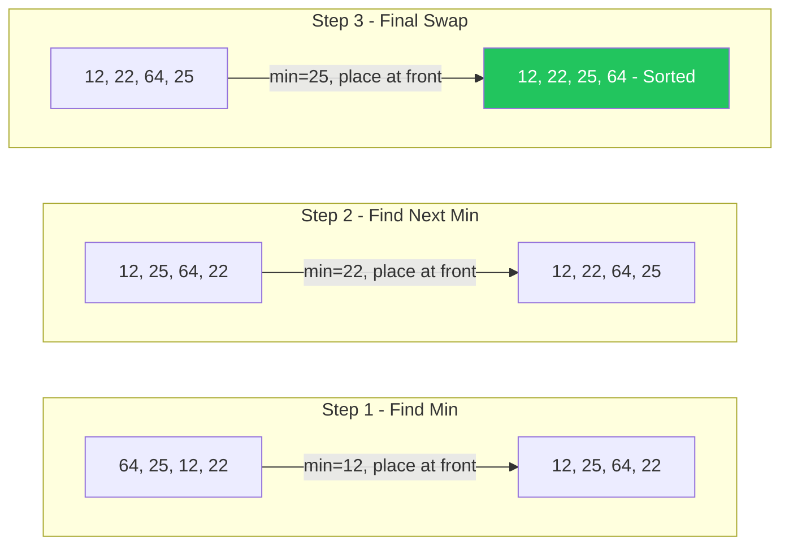

```java
public class SelectionSort {
    public static void sort(int[] arr) {
        int n = arr.length;
        for (int i = 0; i < n - 1; i++) {
            int minIdx = i;
            for (int j = i + 1; j < n; j++) {
                if (arr[j] < arr[minIdx]) {
                    minIdx = j;
                }
            }
            // Place minimum at sorted boundary
            int temp = arr[minIdx];
            arr[minIdx] = arr[i];
            arr[i] = temp;
        }
    }
}
```

> **Key Insight**: Always makes exactly $O(N^2)$ comparisons regardless of input. Minimum number of swaps: $O(N)$.

---

## 3. Insertion Sort

Builds the sorted array one element at a time by inserting each element into its correct position.

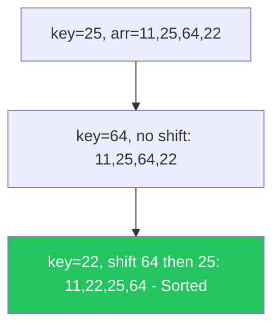

```java
public class InsertionSort {
    public static void sort(int[] arr) {
        int n = arr.length;
        for (int i = 1; i < n; i++) {
            int key = arr[i];
            int j = i - 1;
            // Shift elements greater than key to one position ahead
            while (j >= 0 && arr[j] > key) {
                arr[j + 1] = arr[j];
                j--;
            }
            arr[j + 1] = key;
        }
    }
}
```

> **Key Insight**: Best for small datasets or nearly-sorted arrays. Used internally by Tim Sort.

---

## 4. Shell Sort

An optimized version of Insertion Sort that sorts elements far apart first, then reduces the gap.

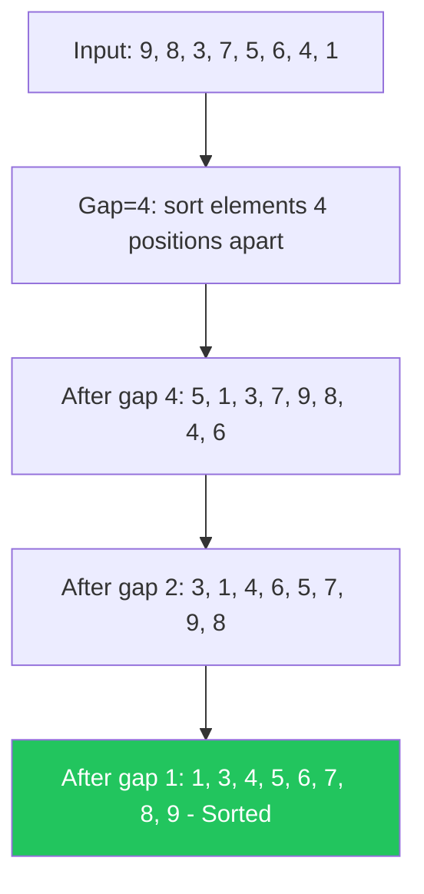

```java
public class ShellSort {
    public static void sort(int[] arr) {
        int n = arr.length;
        // Start with a big gap, then reduce
        for (int gap = n / 2; gap > 0; gap /= 2) {
            // Do a gapped insertion sort for this gap size
            for (int i = gap; i < n; i++) {
                int temp = arr[i];
                int j;
                for (j = i; j >= gap && arr[j - gap] > temp; j -= gap) {
                    arr[j] = arr[j - gap];
                }
                arr[j] = temp;
            }
        }
    }
}
```

> **Key Insight**: Gap sequence affects performance. Knuth's sequence ($h = 3h + 1$) gives roughly $O(N^{1.5})$.

---

## 5. Merge Sort (Divide & Conquer)

Recursively splits the array into halves, sorts each half, then merges them back together.

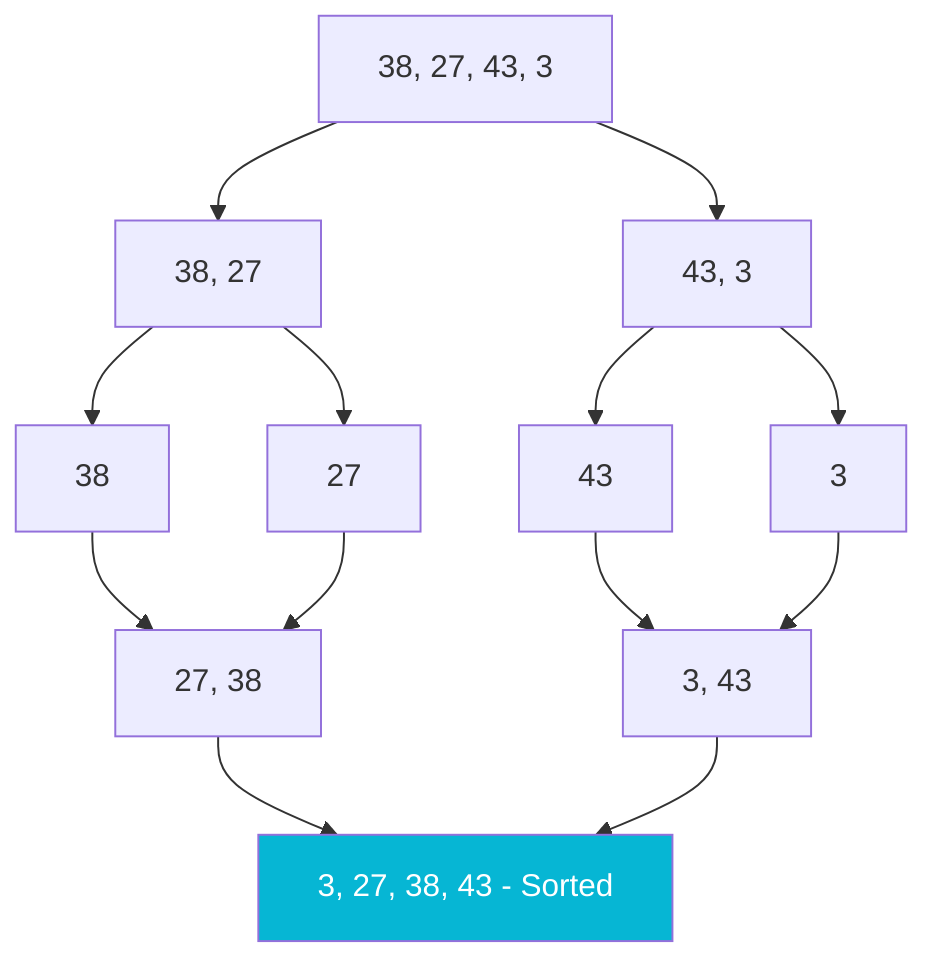

```java
public class MergeSort {
    public static void sort(int[] arr, int left, int right) {
        if (left < right) {
            int mid = left + (right - left) / 2;
            sort(arr, left, mid);
            sort(arr, mid + 1, right);
            merge(arr, left, mid, right);
        }
    }

    private static void merge(int[] arr, int left, int mid, int right) {
        int n1 = mid - left + 1, n2 = right - mid;
        int[] L = new int[n1], R = new int[n2];
        System.arraycopy(arr, left, L, 0, n1);
        System.arraycopy(arr, mid + 1, R, 0, n2);
        int i = 0, j = 0, k = left;
        while (i < n1 && j < n2)
            arr[k++] = (L[i] <= R[j]) ? L[i++] : R[j++];
        while (i < n1) arr[k++] = L[i++];
        while (j < n2) arr[k++] = R[j++];
    }
}
```

> **Key Insight**: Guarantees $O(N \log N)$ always. Preferred for linked lists and external sorting.

---

## 6. Quick Sort (Divide & Conquer)

Picks a pivot, partitions the array so smaller elements go left and larger go right, then recursively sorts each partition.

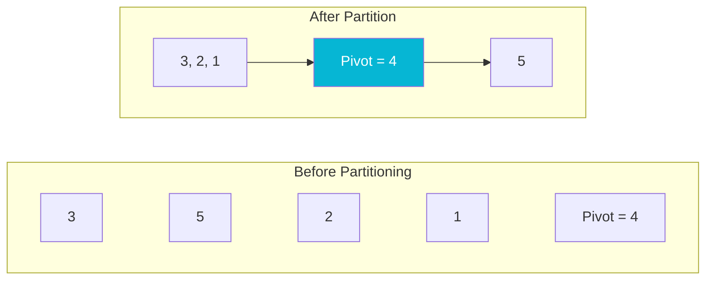

```java
public class QuickSort {
    public static void sort(int[] arr, int low, int high) {
        if (low < high) {
            int p = partition(arr, low, high);
            sort(arr, low, p);
            sort(arr, p + 1, high);
        }
    }

    private static int partition(int[] arr, int low, int high) {
        int pivot = arr[low + (high - low) / 2];
        int i = low - 1, j = high + 1;
        while (true) {
            do { i++; } while (arr[i] < pivot);
            do { j--; } while (arr[j] > pivot);
            if (i >= j) return j;
            int temp = arr[i]; arr[i] = arr[j]; arr[j] = temp;
        }
    }
}
```

> **Key Insight**: Fastest in practice for random data. Worst case ($O(N^2)$) avoided with random pivot or 3-way partition.

---

## 7. Heap Sort

Builds a Max-Heap from the array, then repeatedly extracts the max element to the end.

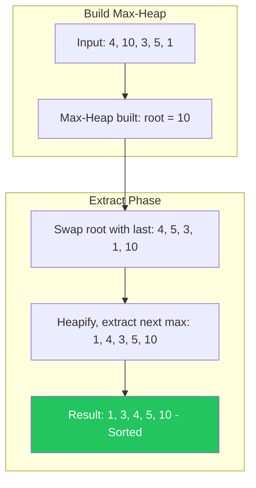

```java
public class HeapSort {
    public static void sort(int[] arr) {
        int n = arr.length;
        // Build max heap
        for (int i = n / 2 - 1; i >= 0; i--)
            heapify(arr, n, i);
        // Extract elements from heap one by one
        for (int i = n - 1; i > 0; i--) {
            int temp = arr[0]; arr[0] = arr[i]; arr[i] = temp;
            heapify(arr, i, 0);
        }
    }

    private static void heapify(int[] arr, int n, int i) {
        int largest = i, left = 2 * i + 1, right = 2 * i + 2;
        if (left < n && arr[left] > arr[largest]) largest = left;
        if (right < n && arr[right] > arr[largest]) largest = right;
        if (largest != i) {
            int temp = arr[i]; arr[i] = arr[largest]; arr[largest] = temp;
            heapify(arr, n, largest);
        }
    }
}
```

> **Key Insight**: In-place $O(N \log N)$ — great when memory is a constraint. Not cache-friendly due to non-sequential access.

---

## 8. Counting Sort

Non-comparison sort. Counts the frequency of each element, then reconstructs the sorted array.

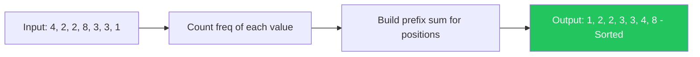

```java
public class CountingSort {
    public static void sort(int[] arr) {
        int max = Arrays.stream(arr).max().getAsInt();
        int[] count = new int[max + 1];

        // Count occurrences
        for (int num : arr) count[num]++;

        // Reconstruct sorted array
        int idx = 0;
        for (int i = 0; i <= max; i++)
            while (count[i]-- > 0) arr[idx++] = i;
    }
}
```

> **Key Insight**: $O(N + K)$ where K is the range of input. Best when K is small (e.g., ages, grades).

---

## 9. Radix Sort

Sorts numbers digit by digit from least significant to most significant using Counting Sort as a subroutine.

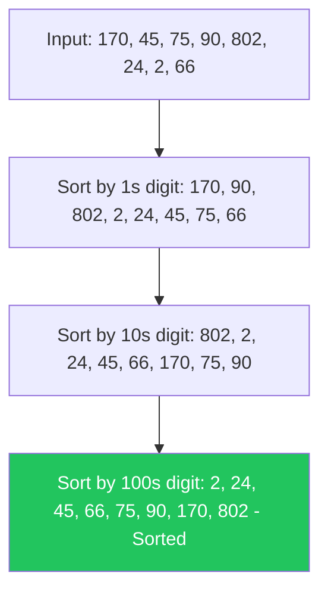

```java
public class RadixSort {
    public static void sort(int[] arr) {
        int max = Arrays.stream(arr).max().getAsInt();
        // Do counting sort for every digit
        for (int exp = 1; max / exp > 0; exp *= 10)
            countByDigit(arr, exp);
    }

    private static void countByDigit(int[] arr, int exp) {
        int n = arr.length;
        int[] output = new int[n];
        int[] count = new int[10];

        for (int num : arr) count[(num / exp) % 10]++;
        for (int i = 1; i < 10; i++) count[i] += count[i - 1];
        for (int i = n - 1; i >= 0; i--) {
            int digit = (arr[i] / exp) % 10;
            output[--count[digit]] = arr[i];
        }
        System.arraycopy(output, 0, arr, 0, n);
    }
}
```

> **Key Insight**: Linear time $O(d \cdot N)$ where d = number of digits. Ideal for integers with bounded digit count.

---

## 10. Tim Sort

A hybrid sorting algorithm combining Merge Sort and Insertion Sort. Used by Java's `Arrays.sort()` for objects.

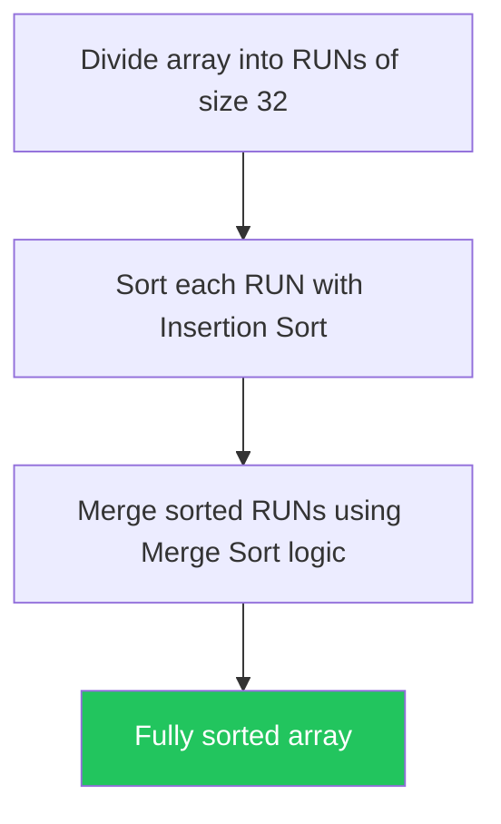

```java
public class TimSort {
    static final int RUN = 32;

    public static void insertionSort(int[] arr, int left, int right) {
        for (int i = left + 1; i <= right; i++) {
            int temp = arr[i];
            int j = i - 1;
            while (j >= left && arr[j] > temp) { arr[j + 1] = arr[j]; j--; }
            arr[j + 1] = temp;
        }
    }

    public static void merge(int[] arr, int left, int mid, int right) {
        int[] leftArr = Arrays.copyOfRange(arr, left, mid + 1);
        int[] rightArr = Arrays.copyOfRange(arr, mid + 1, right + 1);
        int i = 0, j = 0, k = left;
        while (i < leftArr.length && j < rightArr.length)
            arr[k++] = (leftArr[i] <= rightArr[j]) ? leftArr[i++] : rightArr[j++];
        while (i < leftArr.length) arr[k++] = leftArr[i++];
        while (j < rightArr.length) arr[k++] = rightArr[j++];
    }

    public static void sort(int[] arr) {
        int n = arr.length;
        // Sort each run using insertion sort
        for (int i = 0; i < n; i += RUN)
            insertionSort(arr, i, Math.min(i + RUN - 1, n - 1));
        // Merge runs
        for (int size = RUN; size < n; size *= 2) {
            for (int left = 0; left < n; left += 2 * size) {
                int mid = Math.min(left + size - 1, n - 1);
                int right = Math.min(left + 2 * size - 1, n - 1);
                if (mid < right) merge(arr, left, mid, right);
            }
        }
    }
}
```

> **Key Insight**: Java's default sort for objects (`Arrays.sort(Object[])`) uses Tim Sort. Extremely efficient on real-world data with natural runs.

---

## Choosing the Right Algorithm

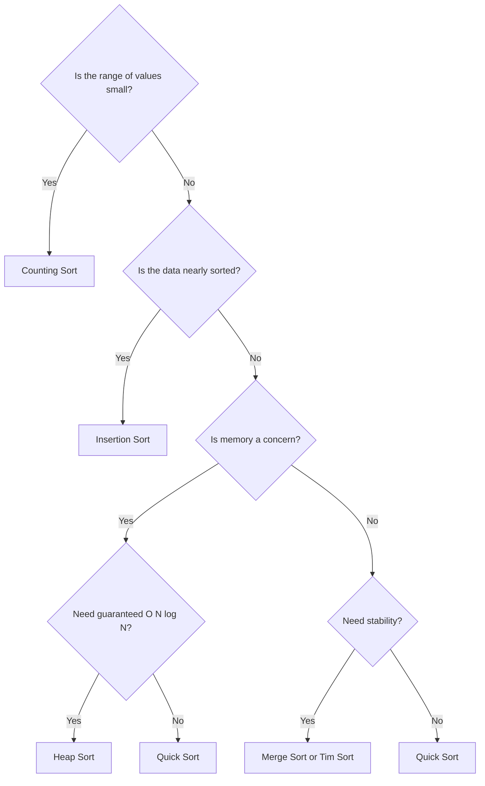

| Use Case | Recommended Algorithm |
|---|---|
| Small array (< 20 elements) | Insertion Sort |
| Nearly sorted data | Insertion Sort or Tim Sort |
| General purpose, in-place | Quick Sort |
| Guaranteed worst-case | Merge Sort or Heap Sort |
| Integer keys, small range | Counting Sort |
| Large integers by digit | Radix Sort |
| Real-world / Java default | Tim Sort |
