# Stack Data Structure

A **Stack** is a linear data structure that follows the **LIFO (Last In, First Out)** principle. The last element added to the stack is the first one to be removed. It behaves like a stack of plates — you always pick from the top.

---

## Core Concept: LIFO Principle

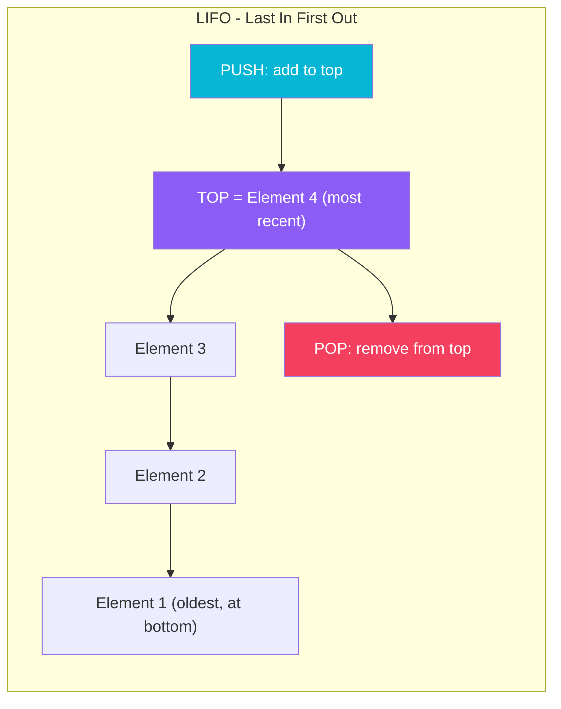

> **Key Rule**: Access is restricted to only the **top** of the stack — no random access like arrays.

---

## Stack Operations & Complexity

| Operation | Description | Time | Space |
| :--- | :--- | :---: | :---: |
| **push(x)** | Add element `x` to the top | $O(1)$ | $O(1)$ |
| **pop()** | Remove and return the top element | $O(1)$ | $O(1)$ |
| **peek() / top()** | View top element without removing | $O(1)$ | $O(1)$ |
| **isEmpty()** | Check if stack has no elements | $O(1)$ | $O(1)$ |
| **isFull()** | Check if stack is at capacity (array only) | $O(1)$ | $O(1)$ |
| **size()** | Return the number of elements | $O(1)$ | $O(1)$ |
| **search(x)** | Find distance from top (Java Stack class) | $O(N)$ | $O(1)$ |

---

## Step-by-Step Operation Diagrams

### 1. Push Operation

Adding elements `10`, `20`, `30` one by one. Each push moves the top pointer up.

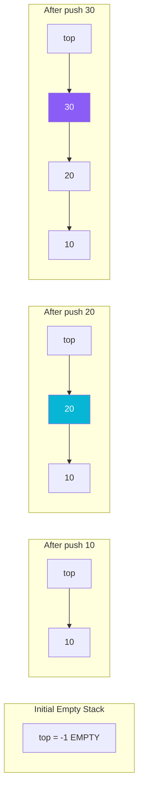

### 2. Pop Operation

Removing from a stack containing `[10, 20, 30]` (30 is at top). Top pointer shifts down.

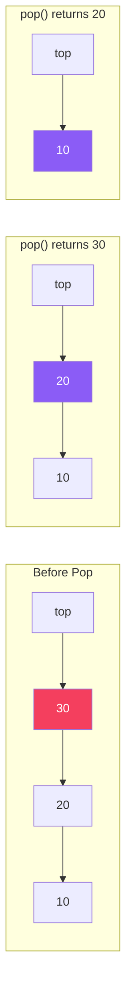

### 3. Peek Operation

Returns the top element **without removing** it. The stack state is unchanged.

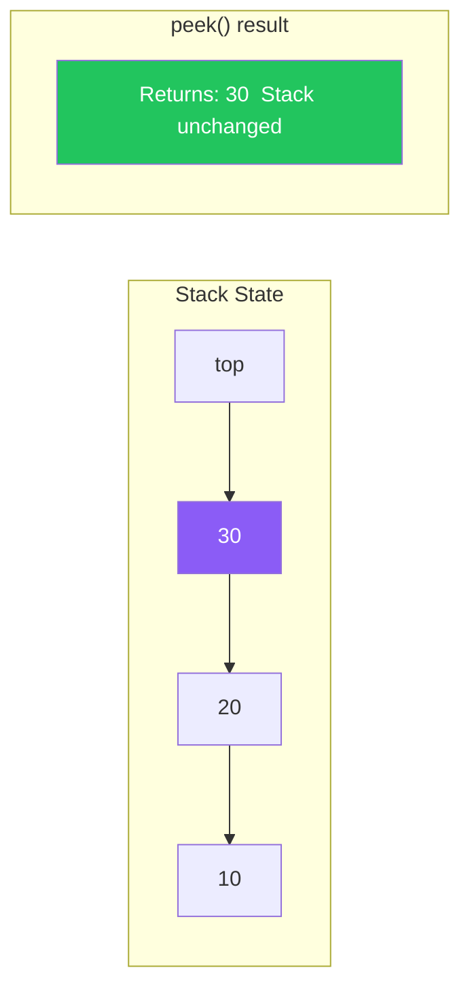

### 4. Stack Overflow and Underflow

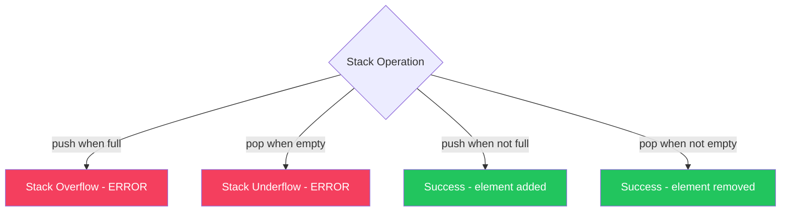

---

## Memory Model: Stack in Memory

### Array-Based Stack
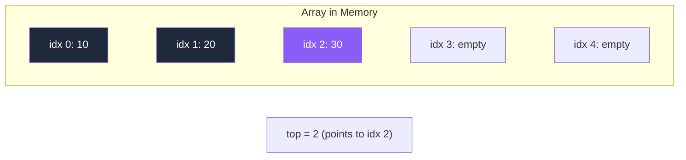

- `top = -1` means empty stack
- `top = capacity - 1` means stack is full
- Every push: `arr[++top] = val`
- Every pop: `return arr[top--]`

### Linked-List-Based Stack
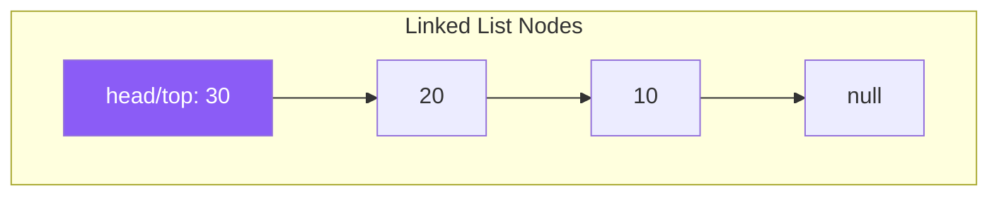

- New node becomes the new `head` on push
- `head` node is removed on pop
- No fixed capacity — grows dynamically

---

## Java Implementations

### 1. Array-Based Stack (Fixed Size)

```java
public class ArrayStack {
    private int[] arr;
    private int top;
    private int capacity;

    public ArrayStack(int size) {
        arr = new int[size];
        capacity = size;
        top = -1;   // -1 means empty
    }

    // Push: O(1)
    public void push(int val) {
        if (top == capacity - 1)
            throw new StackOverflowError("Stack is Full");
        arr[++top] = val;
    }

    // Pop: O(1)
    public int pop() {
        if (isEmpty())
            throw new RuntimeException("Stack Underflow: Stack is Empty");
        return arr[top--];
    }

    // Peek: O(1)
    public int peek() {
        if (isEmpty())
            throw new RuntimeException("Stack is Empty");
        return arr[top];
    }

    public boolean isEmpty() { return top == -1; }
    public boolean isFull()  { return top == capacity - 1; }
    public int size()        { return top + 1; }
}
```

### 2. Linked-List-Based Stack (Dynamic Size)

```java
public class LinkedStack {
    private static class Node {
        int data;
        Node next;
        Node(int data) { this.data = data; }
    }

    private Node top = null;
    private int size = 0;

    // Push: O(1)
    public void push(int val) {
        Node node = new Node(val);
        node.next = top;   // New node points to old top
        top = node;        // Update top to new node
        size++;
    }

    // Pop: O(1)
    public int pop() {
        if (isEmpty())
            throw new RuntimeException("Stack Underflow");
        int val = top.data;
        top = top.next;    // Move top to next node
        size--;
        return val;
    }

    // Peek: O(1)
    public int peek() {
        if (isEmpty())
            throw new RuntimeException("Stack is Empty");
        return top.data;
    }

    public boolean isEmpty() { return top == null; }
    public int size()        { return size; }
}
```

### 3. Using Java's Built-in Stack / Deque

```java
import java.util.*;

// Option A: java.util.Stack (legacy, thread-safe)
Stack<Integer> stack = new Stack<>();
stack.push(10);
stack.push(20);
int top = stack.peek();   // 20
int val = stack.pop();    // 20
boolean empty = stack.isEmpty();

// Option B: ArrayDeque as Stack (preferred - faster)
Deque<Integer> stack2 = new ArrayDeque<>();
stack2.push(10);          // addFirst
stack2.push(20);
int top2 = stack2.peek(); // peekFirst
int val2 = stack2.pop();  // removeFirst
```

> **Best Practice**: Use `ArrayDeque` over `Stack` class in modern Java — it's faster and not synchronized.

---

## Advanced Stack Variations

### 4. Min Stack — Get Minimum in O(1)

A stack that supports `getMin()` in $O(1)$ by maintaining an auxiliary stack tracking minimums.

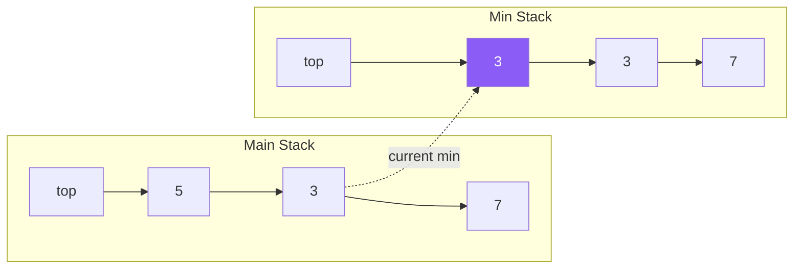

```java
public class MinStack {
    private Deque<Integer> mainStack = new ArrayDeque<>();
    private Deque<Integer> minStack  = new ArrayDeque<>();

    public void push(int val) {
        mainStack.push(val);
        // Push to minStack only if it's the new minimum
        if (minStack.isEmpty() || val <= minStack.peek())
            minStack.push(val);
    }

    public int pop() {
        int val = mainStack.pop();
        if (val == minStack.peek())
            minStack.pop();
        return val;
    }

    public int peek()   { return mainStack.peek(); }
    public int getMin() { return minStack.peek(); }  // O(1)
}
```

---

### 5. Two Stacks in One Array

Use a single array to hold two stacks — Stack 1 grows from the left, Stack 2 from the right. Overflow only when they meet.

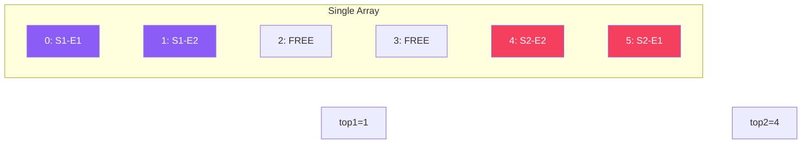

```java
public class TwoStacks {
    private int[] arr;
    private int top1, top2, size;

    public TwoStacks(int n) {
        arr = new int[n];
        size = n;
        top1 = -1;
        top2 = n;
    }

    public void push1(int val) {
        if (top1 + 1 == top2) throw new RuntimeException("Stack Overflow");
        arr[++top1] = val;
    }

    public void push2(int val) {
        if (top1 + 1 == top2) throw new RuntimeException("Stack Overflow");
        arr[--top2] = val;
    }

    public int pop1() {
        if (top1 == -1) throw new RuntimeException("Stack 1 Underflow");
        return arr[top1--];
    }

    public int pop2() {
        if (top2 == size) throw new RuntimeException("Stack 2 Underflow");
        return arr[top2++];
    }
}
```

---

### 6. Stack Using Two Queues

Simulate stack (LIFO) behavior using two queues (FIFO).

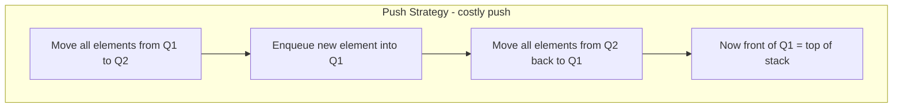

```java
public class StackUsingQueues {
    private Queue<Integer> q1 = new LinkedList<>();
    private Queue<Integer> q2 = new LinkedList<>();

    // Push: O(N)
    public void push(int val) {
        q2.add(val);
        while (!q1.isEmpty()) q2.add(q1.poll());
        Queue<Integer> temp = q1; q1 = q2; q2 = temp;
    }

    // Pop: O(1)
    public int pop() {
        if (q1.isEmpty()) throw new RuntimeException("Stack Empty");
        return q1.poll();
    }

    // Peek: O(1)
    public int peek() { return q1.peek(); }
    public boolean isEmpty() { return q1.isEmpty(); }
}
```

---

## Classic Stack Problems

### 7. Balanced Parentheses / Bracket Matching

Check if brackets `()`, `[]`, `{}` are correctly matched and nested.

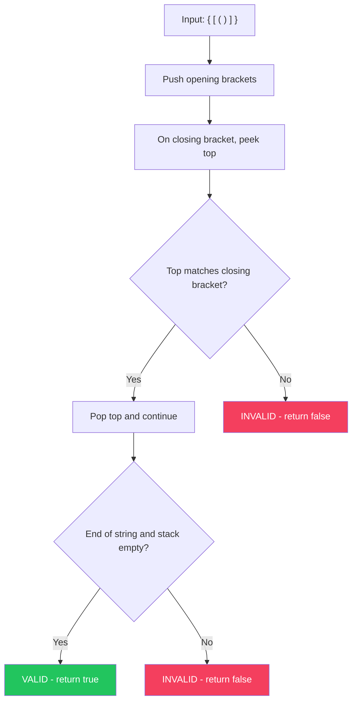

```java
public static boolean isValid(String s) {
    Deque<Character> stack = new ArrayDeque<>();
    for (char c : s.toCharArray()) {
        if (c == '(' || c == '[' || c == '{') {
            stack.push(c);
        } else {
            if (stack.isEmpty()) return false;
            char top = stack.pop();
            if (c == ')' && top != '(') return false;
            if (c == ']' && top != '[') return false;
            if (c == '}' && top != '{') return false;
        }
    }
    return stack.isEmpty(); // Valid only if stack is empty at the end
}
```

---

### 8. Infix to Postfix Conversion

Convert `A + B * C` (infix) → `A B C * +` (postfix) using operator precedence.

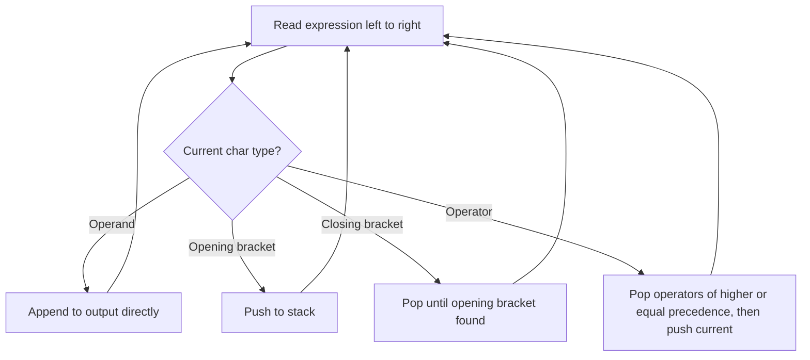

```java
public static String infixToPostfix(String expr) {
    StringBuilder result = new StringBuilder();
    Deque<Character> stack = new ArrayDeque<>();

    for (char c : expr.toCharArray()) {
        if (Character.isLetterOrDigit(c)) {
            result.append(c);              // Operand: add to output
        } else if (c == '(') {
            stack.push(c);
        } else if (c == ')') {
            while (!stack.isEmpty() && stack.peek() != '(')
                result.append(stack.pop());
            stack.pop(); // remove '('
        } else {
            // Operator: pop higher/equal precedence operators first
            while (!stack.isEmpty() && precedence(stack.peek()) >= precedence(c))
                result.append(stack.pop());
            stack.push(c);
        }
    }
    while (!stack.isEmpty()) result.append(stack.pop());
    return result.toString();
}

private static int precedence(char op) {
    if (op == '+' || op == '-') return 1;
    if (op == '*' || op == '/') return 2;
    if (op == '^')              return 3;
    return 0;
}
```

**Example**: `A+B*C` → Output: `ABC*+`

---

### 9. Evaluate Postfix Expression

Evaluate `5 3 2 * + 9 -` = `5 + (3*2) - 9` = `2`.

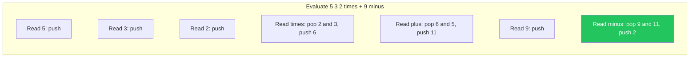

```java
public static int evalPostfix(String expr) {
    Deque<Integer> stack = new ArrayDeque<>();
    for (String token : expr.split(" ")) {
        if (token.matches("-?\\d+")) {
            stack.push(Integer.parseInt(token));
        } else {
            int b = stack.pop(), a = stack.pop();
            switch (token) {
                case "+" -> stack.push(a + b);
                case "-" -> stack.push(a - b);
                case "*" -> stack.push(a * b);
                case "/" -> stack.push(a / b);
            }
        }
    }
    return stack.pop();
}
```

---

### 10. Next Greater Element (NGE)

For each element, find the next element that is greater than it.

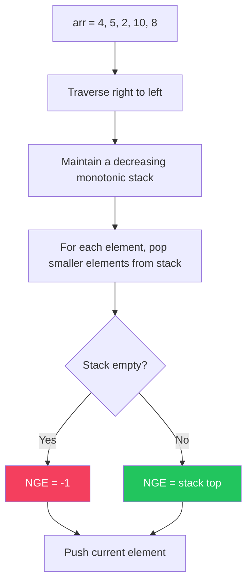

```java
public static int[] nextGreaterElement(int[] arr) {
    int n = arr.length;
    int[] result = new int[n];
    Deque<Integer> stack = new ArrayDeque<>(); // stores indices

    for (int i = n - 1; i >= 0; i--) {
        // Pop all elements smaller than current
        while (!stack.isEmpty() && stack.peek() <= arr[i])
            stack.pop();

        result[i] = stack.isEmpty() ? -1 : stack.peek();
        stack.push(arr[i]);
    }
    return result;
}
// Input:  [4, 5, 2, 10, 8]
// Output: [5, 10, 10, -1, -1]
```

---

### 11. Stock Span Problem

Find how many consecutive days before today (including today) the stock price was less than or equal to today's price.

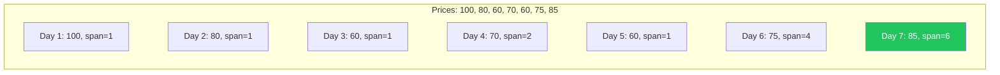

```java
public static int[] stockSpan(int[] prices) {
    int n = prices.length;
    int[] span = new int[n];
    Deque<Integer> stack = new ArrayDeque<>(); // stores indices

    for (int i = 0; i < n; i++) {
        // Pop all days with price less than or equal to current
        while (!stack.isEmpty() && prices[stack.peek()] <= prices[i])
            stack.pop();

        span[i] = stack.isEmpty() ? i + 1 : i - stack.peek();
        stack.push(i);
    }
    return span;
}
```

---

### 12. Largest Rectangle in Histogram

Find the largest rectangular area in a histogram.

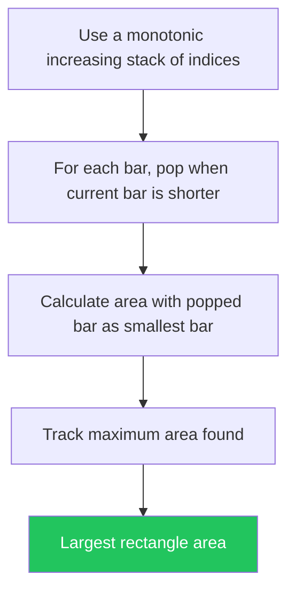

```java
public static int largestRectangle(int[] heights) {
    Deque<Integer> stack = new ArrayDeque<>();
    int maxArea = 0;
    int n = heights.length;

    for (int i = 0; i <= n; i++) {
        int h = (i == n) ? 0 : heights[i];
        while (!stack.isEmpty() && heights[stack.peek()] > h) {
            int height = heights[stack.pop()];
            int width  = stack.isEmpty() ? i : i - stack.peek() - 1;
            maxArea = Math.max(maxArea, height * width);
        }
        stack.push(i);
    }
    return maxArea;
}
```

---

### 13. Reverse a String Using Stack

```java
public static String reverse(String s) {
    Deque<Character> stack = new ArrayDeque<>();
    for (char c : s.toCharArray()) stack.push(c);
    StringBuilder sb = new StringBuilder();
    while (!stack.isEmpty()) sb.append(stack.pop());
    return sb.toString();
}
// "hello" → "olleh"
```

---

### 14. Sort a Stack (Using Recursion)

```java
public static void sortStack(Deque<Integer> stack) {
    if (!stack.isEmpty()) {
        int top = stack.pop();
        sortStack(stack);          // Sort remaining stack
        insertSorted(stack, top);  // Insert top in sorted order
    }
}

private static void insertSorted(Deque<Integer> stack, int val) {
    if (stack.isEmpty() || stack.peek() <= val) {
        stack.push(val);
    } else {
        int top = stack.pop();
        insertSorted(stack, val);
        stack.push(top);
    }
}
```

---

## Real-World Applications of Stack

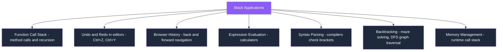

### Function Call Stack Example
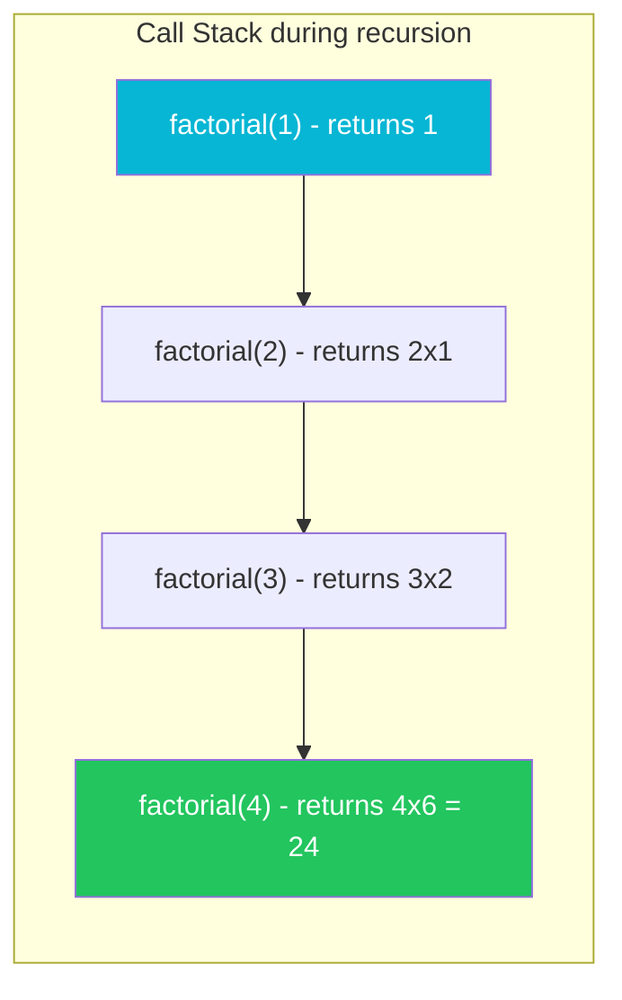

---

## Stack vs Queue vs Deque

| Feature | Stack | Queue | Deque |
|---|---|---|---|
| **Order** | LIFO | FIFO | Both ends |
| **Insert** | top (push) | rear (enqueue) | front or rear |
| **Remove** | top (pop) | front (dequeue) | front or rear |
| **Peek** | top | front | front or rear |
| **Use Case** | Undo, DFS, recursion | BFS, scheduling | Sliding window, palindrome |

---

## Summary of Concepts

| Concept | Key Point |
|---|---|
| **LIFO** | Last element pushed is first to be popped |
| **Array Stack** | Fixed size, fast, no memory overhead |
| **Linked Stack** | Dynamic size, extra pointer memory |
| **Min Stack** | Auxiliary stack tracks minimum in O(1) |
| **Two Stacks** | Start from opposite ends of one array |
| **Balanced Brackets** | Push open, match on close |
| **Infix to Postfix** | Use precedence + operator stack |
| **NGE** | Monotonic decreasing stack from right |
| **Stock Span** | Monotonic increasing stack of indices |
| **Histogram** | Monotonic increasing stack for areas |
